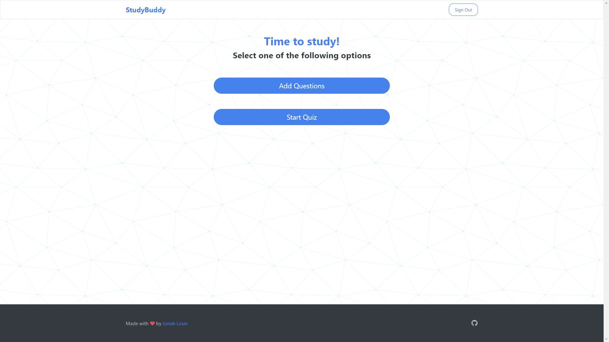

<h1 align="center"><a href="https://jonahlouis4.github.io/StudyBuddy/">Study Buddy</a></h1>
<p align="center">A simple <b>flash card</b> web application made with <a href="https://reactjs.org/docs/hooks-overview.html" target="_blank">React</a>.</p>
<!-- <div align="center"></div> -->

## :question: How does it work
1. From the [homepage](https://jonahlouis4.github.io/StudyBuddy/), press on **add questions* :heavy_plus_sign:.
    - Enter a question and the answer to question. After doing so, press the **add button**  :heavy_plus_sign:.
2. Return to the [homepage](https://jonahlouis4.github.io/StudyBuddy/) by pressing the **arrow icon** :arrow_backward: (top left), and press on **start the quiz** :pencil:.
3. Enjoy!

:warning: *Note: Question order is randomized*

## :running: To run locally
From the extracted zip, and inside the second folder.
1. Install npm in the project folder 
```sh
npm i
```
2. Run the app 
```sh
npm start
```

## :art: Main colours
All colours are from [Open Color](https://yeun.github.io/open-color/) and [color hex](https://www.color-hex.com/color-palette/25362).

| Colours	     | Code																		        |
|----------------|----------------------------------------------------------------------------------|
| Dark Grey	     | `#23272A`         |
| Dark Grey 2    | `##2C2F33`        |
|"RED 5"	     | `#FF6B6B`         |
|"RED 5" (hover) | `#ff6b6b80`   |
|"RED 5" (error) | `#ff6b6b3f`   |
|"BLUE 5" 	     | `#339AF0`  	    |
|"BLUE 5" (hover)| `#339bf080`   |
|"GREEN 3"       | `#8ce99a`  		|	

## :memo: Future releases

A list of possible future implementation:

- [x] Database implementation
- [x] Ability to log in and create an account
- [ ] Ability to add questions within subjects
